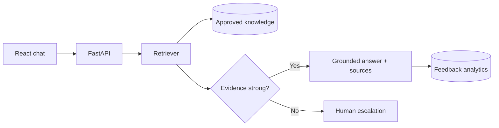

# AI-Powered Customer Support Assistant

A production-minded customer support application that gives customers fast answers **without inventing policy details**. It retrieves relevant passages from an approved knowledge base, generates or extracts an answer, displays source citations and confidence, collects feedback, and routes uncertain questions to a human.

   

## Why this solves a real support problem

Many chatbot demos optimize for fluent answers. Support teams need **verified answers, safe failure behavior, content controls, and measurable quality**. This project treats those as product requirements:

- **Grounded RAG responses:** retrieves only from company-approved documents.
- **Citations and confidence:** customers and agents can inspect the evidence behind an answer.
- **Hallucination control:** temperature 0, strict context-only instructions, and a retrieval threshold.
- **Human escalation:** uncertain or unsupported questions are handed off instead of guessed.
- **Knowledge management:** protected upload/list/delete endpoints for Markdown, text, and PDF documents.
- **Feedback and analytics:** helpfulness, conversation, answer, and escalation metrics.
- **Privacy-aware design:** no full card data in sample policies; secrets stay server-side.
- **Zero-cost demo mode:** deterministic local retrieval works without an external API key.

## Architecture



## Tech stack

| Layer | Technology |
| --- | --- |
| Frontend | React, TypeScript, Vite, responsive CSS |
| API | Python, FastAPI, Pydantic |
| Retrieval | TF-IDF-style local search; chunking with section metadata |
| Generation | OpenAI API + strict grounded prompt, or offline extractive mode |
| Data | SQLite for portable demo; schema supports conversations, feedback, and escalations |
| Delivery | Docker, Docker Compose, Nginx, health checks |
| Quality | Pytest API tests, Ruff, ESLint, TypeScript strict mode |

## Quick start with Docker

```bash
cp .env.example .env
docker compose up --build
```

Open the customer UI at `http://localhost:3000` and API documentation at `http://localhost:8000/docs`.

The default `AI_PROVIDER=local` requires no API key. To use an OpenAI model, set:

```env
AI_PROVIDER=openai
OPENAI_API_KEY=your-key
```

Never commit the `.env` file.

## Run locally

Backend:

```bash
cd backend
python -m venv .venv
source .venv/bin/activate
pip install -r requirements-dev.txt
uvicorn app.main:app --reload
```

Frontend, in a second terminal:

```bash
cd frontend
npm install
npm run dev
```

## API examples

Ask a question:

```bash
curl -X POST http://localhost:8000/api/chat \
  -H 'Content-Type: application/json' \
  -d '{"message":"How long do I have to return an item?"}'
```

Upload an approved knowledge document:

```bash
curl -X POST http://localhost:8000/api/admin/documents \
  -H 'X-Admin-Key: change-me-before-deploying' \
  -F 'file=@company-policy.pdf'
```

## Accuracy approach

1. Split documents by semantic Markdown headings and bounded windows.
2. Rank chunks by term relevance with length normalization.
3. Reject responses below `MIN_RETRIEVAL_SCORE`.
4. Generate with retrieved context only, or use deterministic extractive answering.
5. Return the retrieved passages as user-visible citations.
6. Capture thumbs-up/down feedback and escalation rate for ongoing evaluation.

Before production, add a company-specific evaluation set and measure groundedness, answer correctness, retrieval recall, escalation precision, latency, and cost. Tune the threshold against that data rather than relying on a universal value.

## Test

```bash
cd backend
pytest -q
ruff check app tests

cd ../frontend
npm run build
npm run lint
```

Tests cover health, grounded answers with citations, unknown-question escalation, admin authorization, and feedback capture.

## Production roadmap

- Replace SQLite with managed PostgreSQL and add tenant isolation.
- Use hybrid vector + keyword retrieval and a reranker for larger knowledge bases.
- Add SSO/RBAC, audit logging, PII redaction, encryption, rate limiting, and retention controls.
- Connect escalation to Zendesk, Salesforce Service Cloud, Intercom, or Freshdesk.
- Add scheduled evaluation and drift monitoring before automated policy publishing.

## Resume-ready project entry

**AI-Powered Customer Support Assistant** | Python, FastAPI, React, TypeScript, OpenAI API, RAG, SQLite, Docker

- Engineered a full-stack customer support assistant that delivers grounded responses from approved policy documents, with source citations, confidence scoring, and automatic human escalation for unsupported questions.
- Built FastAPI services for conversational search, PDF/Markdown knowledge ingestion, feedback capture, and support analytics; added protected admin APIs and persistent conversation history.
- Implemented retrieval thresholds and context-only generation guardrails to reduce hallucinations, plus a deterministic offline mode for cost-free testing and reproducible demos.
- Delivered a responsive React/TypeScript chat experience and containerized deployment with Docker Compose, health checks, automated API tests, and CI-ready linting.

> Use only claims and metrics you can demonstrate. After running a labeled evaluation set, replace general claims with measured results such as grounded-answer accuracy, escalation precision, or response latency.

## License

MIT

